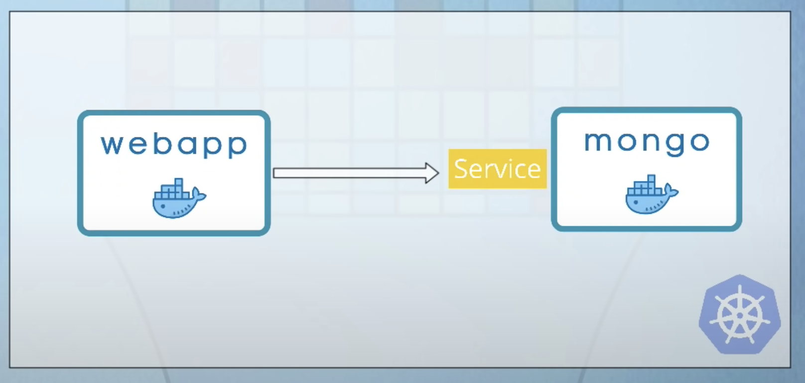

# Tarea 2

## Descripcion de la applicacion

El proyecto proviene de [este tutorial](https://www.youtube.com/watch?v=s_o8dwzRlu4). Consiste de 2 pods, uno que maneja la aplicacion y otro que maneja la base de datos. La siguiente imagen describe el servicio de forma simple:

